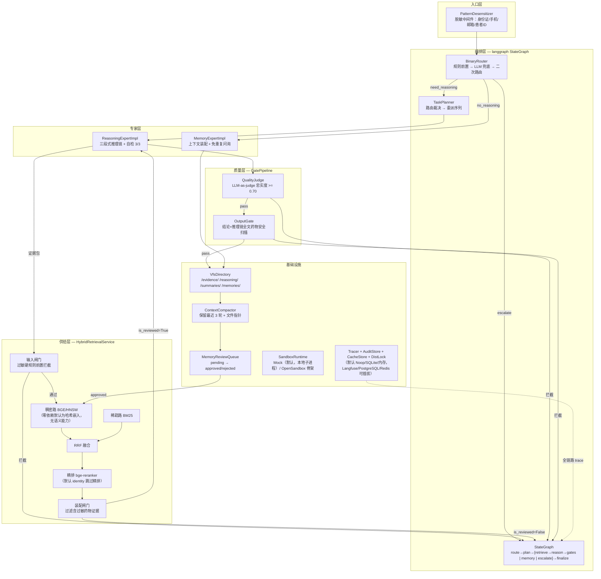
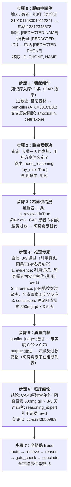
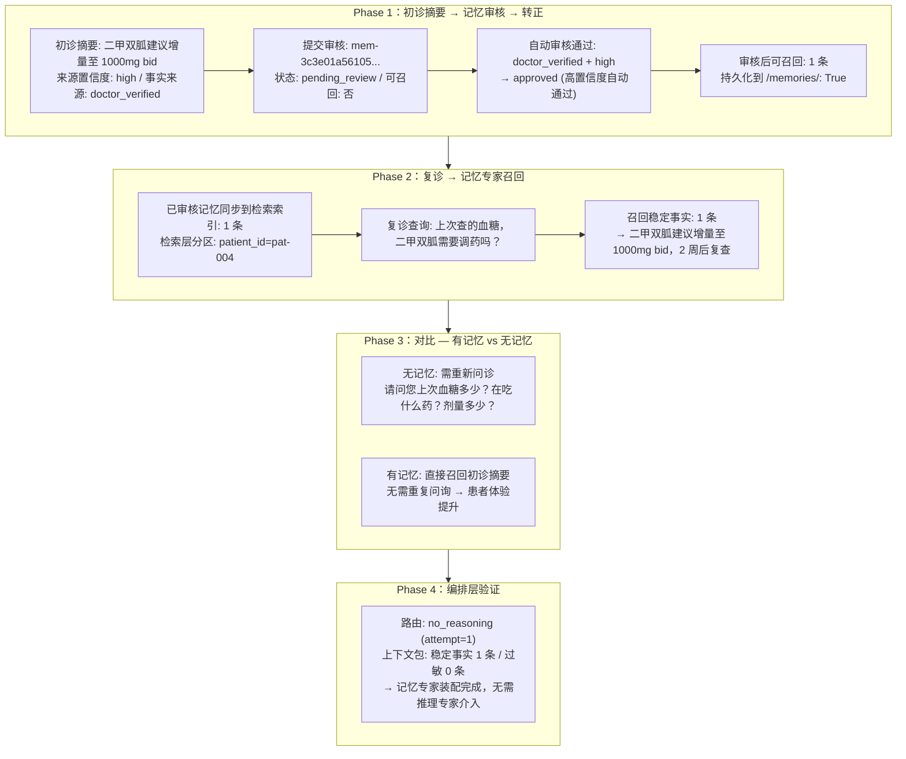

# harness-medical-agent

> Harness Engineering 范式的医疗多智能体系统：把工程脚手架做厚，而非换更强的模型。

[](https://github.com/bobsmith513/harness-medical-agent/actions/workflows/ci.yml)


> 测试现状：**581 个用例**，零依赖 mock 环境全绿（可本地 `uv run pytest` 复跑）；`--all-extras` CI 环境为 577 通过 + 4 跳过（CI 全绿见顶部徽章，跳过原因见[测试体系](#测试体系在测什么不测什么)）。

**导航**：[快速开始](#快速开始) · [在线调用模式](#在线调用模式填两行-env-即可运行) · [测试体系](#测试体系在测什么不测什么) · [白盒日志走读](#白盒日志全链路走读) · [配置详情](#配置详情) · [项目结构](#项目结构)

## 核心设计原则

| 原则 | 含义 |
|------|------|
| 主 Agent 纯编排 | 规划＋虚拟文件系统＋子代理委派，结构上不产出临床结论 |
| fail-closed | 误路由二次路由、门禁未达标转澄清或人工，绝不静默降级应答 |
| 硬规则不向量化 | 过敏史走药名归一化＋ATC 交叉反应精确匹配，配三道安全闸门 |
| 记忆需审核转正 | 摘要标注来源置信度、抽样审核通过才可召回，阻断推断固化为事实 |
| 患者分区隔离 | patient_id 作为存储分区键，从存储层避免跨患者召回 |

## 系统架构图

以下架构图由代码倒推生成，每个节点对应 `src/harness_agent/` 下的真实模块。
**诚实标注约定**：括号内标注为该节点的零依赖默认形态——与「从 Mock 到生产」
一节的降级表口径一致，未标注的节点在 mock 模式下即为完整实现：



## 系统分层

| 层 | 模块 | 职责（零依赖默认形态 → 生产形态） |
|----|------|------|
| 入口层 | 会话管理 | 脱敏中间件前置（两种形态一致） |
| 编排层 | 主 Agent / 路由器 | 任务拆解与委派；二值路由"是否需要临床推理"（两种形态一致） |
| 专家层 | 推理专家 / 记忆专家 | 推理链生成＋自检；供给编排（两种形态一致） |
| 供给层 | MCP 检索服务 | 混合检索＋安全闸门＋分区隔离（哈希嵌入/BM25 → BGE/Milvus） |
| 质量层 | 质量门禁 | LLM-as-judge 忠实度＋药物安全 API 全量把关（两种形态一致） |
| 基础设施 | 沙箱 / 可观测 | Mock 沙箱 / Noop tracer / SQLite / 内存 → OpenSandbox **骨架** / Langfuse / PostgreSQL / Redis |

## 快速开始

```bash
# 1. 安装依赖（uv 管理，自动创建 .venv 与 uv.lock）
uv sync --all-extras

# 2. 跑测试与静态检查
make test
make lint

# 3. 运行端到端 demo（零外部依赖，mock 模式）
uv run python examples/demo_first_diagnosis.py
uv run python examples/demo_followup_memory.py
uv run python examples/demo_long_conversation.py
uv run python examples/demo_gate_interception.py

# 4. 在线问诊入口（.env 填 PROVIDER + API_KEY 后真实推理）
uv run harness-online                     # 控制台命令（等价 examples/run_online.py）
```

### 用 pip 部署（无 uv 环境）

项目提供四套 requirements 文件，按场景选择：

```bash
# 场景一：演示 / CI（零外部服务，4 个端到端 demo + 5 个模块级 demo + 581 项测试全跑通）
pip install -r requirements.txt && pip install -e .

# 场景二：生产（接入 vLLM / 在线 API，.env 填 8 个字段）
pip install -r requirements-prod.txt && pip install -e .

# 场景三：全量生产（BGE 嵌入 + Milvus + MCP + LLM）
pip install -r requirements-full.txt && pip install -e .

# 场景四：开发（测试 + lint）
pip install -r requirements-dev.txt && pip install -e .
```

| 文件 | 适用场景 | 依赖量 |
|------|---------|--------|
| `requirements.txt` | 演示 / CI / 快速验证 | 4 个核心包（langgraph + pydantic + pydantic-settings + pyyaml） |
| `requirements-prod.txt` | 生产（真实 LLM 端点） | +httpx |
| `requirements-full.txt` | 全量生产（BGE + Milvus + MCP） | +sentence-transformers + torch + pymilvus + fastmcp + numpy |
| `requirements-dev.txt` | 开发 / 测试 / lint | +pytest + pytest-cov + ruff |

## 在线调用模式：填两行 .env 即可运行

不想部署本地模型？直接填一个在线 API，样本数据自动装配，交互式问诊立即可用：

```bash
cp .env.example .env
# 编辑 .env，只填两行：
#   HARNESS_LLM__PROVIDER=deepseek
#   HARNESS_LLM__API_KEY=sk-你的密钥

uv run harness-online
```

启动后自动装配 4 位虚构患者档案 + 8 条知识条目 + 过敏安全种子，
交互循环：选患者 → 提问 → 白盒输出「路由 → 证据包 → 推理链 → 门禁 → 结论」。

### 预设服务商（端点与模型名自动解析）

| provider | 端点 | 推理模型 | judge / 路由模型 |
|----------|------|---------|-----------------|
| `deepseek` | api.deepseek.com/v1 | deepseek-v4-pro | deepseek-v4-flash |
| `qwen` | 阿里云百炼兼容模式 | qwen3.8-max | qwen3.8-flash |
| `zhipu` | 智谱开放平台 | glm-4.6 | glm-4.5-air |
| `moonshot` | 月之暗面 Kimi | kimi-k2.6 | kimi-k2.5 |
| `openai` | OpenAI 官方 | gpt-4o | gpt-4o-mini |
| `siliconflow` | 硅基流动聚合 | DeepSeek-V3 | Qwen2.5-72B |

### 微调模型旁路（混合部署）

推理专家是系统内唯一临床结论产出方，可单独指向本地 vLLM 部署的
SFT+DPO 微调模型，其余角色（路由 / judge）继续走在线 API：

```bash
HARNESS_LLM__PROVIDER=deepseek
HARNESS_LLM__API_KEY=sk-xxx
HARNESS_LLM__REASONING_BASE_URL=http://localhost:8001/v1   # 微调模型旁路
HARNESS_LLM__REASONING_MODEL=sft-dpo-aligned
```

在线调用失败时系统 fail-closed：转人工升级，绝不静默降级应答。

## 从 Mock 到生产：字段一览

系统默认运行在 **mock 模式**：零外部依赖、零 GPU、零 Docker，即可跑通全部 demo 与测试。
切到在线模式只需 **2 个字段**（PROVIDER + API_KEY）；混合部署加 2 个（推理旁路）；
其余数据库依赖全部留空时自动用本地实现：

```bash
cp .env.example .env
```

| 场景 | 需填字段 | 说明 |
|------|---------|------|
| 零依赖演示 | 无（默认 mock） | 581 项测试 + 9 个 demo 全跑通 |
| 在线调用 | `PROVIDER` + `API_KEY`（2 个） | 预设端点自动解析 |
| 混合部署 | + `REASONING_BASE_URL` + `REASONING_MODEL` | 微调模型旁路 |
| 自建端点 | 逐角色 `<ROLE>_BASE_URL` 等 | 通用 OpenAI 兼容协议 |

| 外部依赖 | 留空时降级到 | 填入后切换为 |
|---------|------------|------------|
| Milvus | 本地 numpy 向量 + BM25 | docker-compose |
| BGE-large-zh | 哈希嵌入（零依赖） | sentence-transformers |
| bge-reranker | identity（跳过精排） | 真实模型加载 |
| Langfuse | NoopTracer（仅打印） | 自托管 Langfuse |
| PostgreSQL | SQLite（本地文件） | docker-compose |
| Redis | 内存字典 + 进程内锁 | docker-compose |
| OpenSandbox | MockRuntime（本地子进程） | Docker/K8s |

## 白盒日志全链路走读

以下三个 demo 均为**真实运行日志**（`uv run python examples/demo_*.py` 原样输出）：
编排、检索、门禁与全链路 trace 均为实际执行结果，中间数据非手写；其中 LLM 应答由
`MockLLMClient` 按预设剧本提供——这是零依赖模式的定位（机制详见「测试体系」），
真实模型的在线链路见[在线调用模式](#在线调用模式填两行-env-即可运行)。

两点成色说明（避免误读）：零依赖 demo 中检索层使用**静态证据桩**
（`examples/demo_first_diagnosis.py` 的 `_StaticRetrieval`，返回预置 `EvidencePack`），
"忠实度 0.92" 等门禁数值为剧本预设值——demo 验证的是**编排与门禁的工程行为**
（路由裁决、拦截链、trace 结构），不是检索与推理的应答质量。

### 例一：初诊推理全链路（7 步）

**患者**：张明，45 岁男，青霉素过敏，咳嗽三天伴发热 38.5 度



<details>
<summary>查看完整白盒日志</summary>

```
M8 端到端演示一：初诊推理全链路
全链路 Mock LLM + 内存检索栈（零外部依赖）
患者档案：pat-001 张明，45 岁男，青霉素过敏，咳嗽三天伴发热

========================================================================
步骤 0：脱敏中间件前置
========================================================================
  原始输入: 患者：张明（身份证 310101198001011234）咳嗽三天，
            发烧 38.5 度，之前打盘尼西林过敏，用药方案怎么定？电话 13812345678
  脱敏后:   [REDACTED-NAME]（身份证 [REDACTED-ID]）咳嗽三天，发烧 38.5 度，
            之前打盘尼西林过敏，用药方案怎么定？电话 [REDACTED-PHONE]
  移除标识: ID:310101198001011234, PHONE:13812345678, NAME:患者：张明
  → 患者标识已替换为 [REDACTED-xx] 占位符

========================================================================
步骤 1：装配全链路组件
========================================================================
  知识库入库: 2 条（CAP 指南）
  过敏史: 盘尼西林 → penicillin (ATC=J01CE01)
    交叉反应阻断: amoxicillin, ceftriaxone
  可观测栈: NoopTracer + SQLiteAuditStore + MemoryCacheStore

========================================================================
步骤 2：路由器裁决
========================================================================
  查询: 咳嗽三天伴发热，用药方案怎么定？
  路由: need_reasoning (by_rule=True)
  规则命中: 规则前置命中: need_reasoning

========================================================================
步骤 3：检索供给层
========================================================================
  证据包: 1 条, is_reviewed=True
  阻断药物: （无）
  [命中] [ev-1] CAP 患者若对 β-内酰胺类过敏，可选大环内酯类（阿奇霉素）替代。
          阿奇霉素 500mg qd，疗程 3-5 天，与青霉素无交叉反应。

========================================================================
步骤 4：推理专家（三段式推理链 + 自检）
========================================================================
  自检: True — 自检通过（3/3）：引用真实、因果正向、依据充分；证据 1 条
  推理链 3 步:
    1. [evidence] 引用证据：CAP 患者对 β-内酰胺类过敏时，阿奇霉素为
       安全替代方案，常规剂量 500mg qd (引用: ['ev-1'])
    2. [inference] 患者有 β-内酰胺类过敏史，阿奇霉素与之无交叉反应，
       可安全使用；结合咳嗽发热症状与 CAP 指南，经验性治疗合理
    3. [conclusion] 建议阿奇霉素 500mg qd，疗程 3-5 天，
       门诊随访观察疗效 (引用: ['ev-1'])

========================================================================
步骤 5：质量门禁（LLM-judge + 输出闸门）
========================================================================
  quality_judge: 通过 — 质量门禁通过：忠实度 0.92 ≥ 0.7，无臆测/因果倒置
  output: 通过 — 输出校验通过：未涉及过敏药物

========================================================================
步骤 6：临床结论输出
========================================================================
  结论: CAP 经验性治疗：阿奇霉素 500mg qd × 3-5 天
  产出者: reasoning_expert
  引用证据: ['ev-1']
  结论ID: cc-ea7f0b509fb9

========================================================================
步骤 7：全链路 trace 事件
========================================================================
  [TRACE] route: {'decision': 'need_reasoning', 'by_rule': True}
  [TRACE] retrieve: {'query': '咳嗽三天伴发热，用药方案怎么定？', 'evidence_count': 1}
  [TRACE] reason: {'chain_steps': 3, 'self_check': True}
  [TRACE] gate_check: {'quality_judge': 'pass', 'output': 'pass'}
  [TRACE] conclude: {'statement': 'CAP 经验性治疗：阿奇霉素 500mg qd × 3-5 天'}
  全链路事件总数: 5

========================================================================
初诊推理全链路验收总结:
  ✓ 脱敏中间件前置（患者标识去除）
  ✓ 路由器规则命中（need_reasoning，零 LLM 开销）
  ✓ 检索供给（知识库双路召回 + 装配闸门复核）
  ✓ 推理专家（三段式推理链 + 自检 3/3 通过）
  ✓ 质量门禁（LLM-judge 忠实度 0.92 ≥ 0.70）
  ✓ 输出闸门（药物安全全文扫描通过，阿奇霉素不在阻断列表）
  ✓ 临床结论交付（含证据溯源与推理链）
  ✓ 全链路 trace 事件 5 个可打印
========================================================================
```
</details>

### 例二：复诊记忆命中免问询（4 Phase）

**患者**：赵雪，60 岁女，2 型糖尿病复查（初诊结论已审核转正为可召回记忆）



<details>
<summary>查看完整白盒日志</summary>

```
M8 端到端演示二：复诊记忆命中免问询
全链路内存 VFS + 内存检索栈（零外部依赖）
患者档案：pat-004 赵雪，60 岁女，2 型糖尿病复查

========================================================================
Phase 1：初诊摘要 → 记忆审核 → 转正为可召回记忆
========================================================================
  初诊摘要: 二甲双胍建议增量至 1000mg bid，2 周后复查
  来源置信度: high
  事实来源: doctor_verified

  提交审核: memory_id=mem-0fa45e803fb3...
  状态: pending_review
  可召回: 否

  自动审核（doctor_verified + high 自动通过）:
    mem-0fa45e803fb3... → approved (高置信度自动通过)

  审核后可召回记忆: 1 条
  持久化到 /memories/: True

========================================================================
Phase 2：复诊 → 记忆专家召回已审核记忆 → 免问询
========================================================================
  已审核记忆同步到检索索引: 1 条
  检索层分区: patient_id=pat-004

  复诊查询: 上次查的血糖，二甲双胍需要调药吗？
  可召回记忆: 1 条
  召回稳定事实: 1 条
    → 二甲双胍建议增量至 1000mg bid，2 周后复查
  过敏史: 0 条（本患者无过敏）

========================================================================
Phase 3：对比 — 有记忆 vs 无记忆
========================================================================
  【无记忆场景】
    需重新问诊：请问您上次血糖多少？在吃什么药？剂量多少？
    患者重复提供信息 → 体验差 + 易遗漏关键信息

  【有记忆场景】
    记忆专家直接召回初诊摘要:
      → 二甲双胍建议增量至 1000mg bid，2 周后复查
    无需重复问询 → 患者体验提升 + 信息完整

========================================================================
Phase 4：编排层验证（no_reasoning 路径免推理）
========================================================================
  路由: no_reasoning (attempt=1)
  上下文包: 稳定事实 1 条 / 过敏 0 条
  → 记忆专家装配完成，无需推理专家介入

========================================================================
复诊记忆命中免问询验收总结:
  ✓ 初诊摘要标注来源置信度 + 提交审核队列
  ✓ 审核通过 → 转正为可召回记忆 + 持久化到 /memories/
  ✓ 复诊时记忆专家召回已审核记忆（分区隔离）
  ✓ 免重复问询（稳定事实直接命中）
  ✓ 未审核记忆不可召回（can_be_recalled=False 强制约束）
  ✓ 编排层 no_reasoning 路径验证（记忆专家直接装配）
========================================================================
```
</details>

### 例三：门禁拦截转人工（3 拦截 + 1 对照）

**核心语义**：fail-closed —— 拦截即 interrupt，结论被门禁撤回，绝不静默放行

```mermaid
flowchart TD
    subgraph S1 ["场景 1：忠实度不足 → 质量门禁拦截"]
        S1A["LLM-judge 忠实度 0.30 < 阈值 0.70"] --> S1B["拦截门禁: quality_judge<br/>结论: （被门禁拦截，未交付）<br/>升级: to_human=True"]
    end

    subgraph S2 ["场景 2：臆测检测 → 质量门禁拦截"]
        S2A["结论引入证据未提及的推断<br/>（肝功能指标未在证据中出现）"] --> S2B["拦截门禁: quality_judge<br/>has_hallucination=True<br/>升级: to_human=True"]
    end

    subgraph S3 ["场景 3：过敏药物 → 输出闸门拦截"]
        S3A["结论提及 penicillin<br/>（患者 pat-001 青霉素过敏）"] --> S3B["quality_judge: 通过 (0.95 ≥ 0.70)"] --> S3C["output: 拦截<br/>临床结论/推理链提及患者过敏药物: penicillin<br/>升级: to_human=True"]
    end

    subgraph S4 ["场景 4：正常对照 → 全门禁通过"]
        S4A["推理链合法 + 忠实度 0.92<br/>+ 无过敏药物"] --> S4B["quality_judge: 通过<br/>output: 通过"] --> S4C["结论: 建议阿奇霉素 500mg qd 治疗 CAP<br/>正常交付"]
    end
```



<details>
<summary>查看完整白盒日志</summary>

```
M8 端到端演示四：门禁拦截转人工
全链路 Mock LLM（零外部依赖）
fail-closed 语义：拦截即 interrupt，绝不静默放行

========================================================================
场景 1：忠实度不足 → 质量门禁拦截 → 转人工
========================================================================
  LLM-judge 忠实度 0.30 < 阈值 0.70 → 拦截
  路由: need_reasoning
  结论: （被门禁拦截，未交付）
  门禁 quality_judge: 拦截 — LLM-judge 拦截：忠实度 0.30 < 阈值 0.7
  升级: to_human=True
  原因: 门禁拦截（gate:quality_judge）: LLM-judge 拦截：忠实度 0.30 < 阈值 0.7

========================================================================
场景 2：臆测检测 → 质量门禁拦截 → 转人工
========================================================================
  推理结论引入了证据未提及的推断（臆测）
  路由: need_reasoning
  结论: （被门禁拦截，未交付）
  门禁 quality_judge: 拦截 — LLM-judge 拦截：检测到臆测
    （结论提及了证据中未出现的肝功能指标）
  升级: to_human=True
  原因: 门禁拦截（gate:quality_judge）: LLM-judge 拦截：检测到臆测（结论提及了证据中未出现的肝功能指标）

========================================================================
场景 3：过敏药物 → 输出闸门拦截 → 转人工
========================================================================
  结论提及 penicillin（患者青霉素过敏）
  → 质量门禁通过、输出闸门拦截
  路由: need_reasoning
  结论: （被门禁拦截，未交付）
  门禁 quality_judge: 通过 — 质量门禁通过：忠实度 0.95 ≥ 0.7，无臆测/因果倒置
  门禁 output: 拦截 — 临床结论/推理链提及患者过敏/交叉反应药物: penicillin
  升级: to_human=True
  原因: 门禁拦截（gate:output）: 临床结论/推理链提及患者过敏/交叉反应药物: penicillin

========================================================================
场景 4：正常对照 — 门禁全通过 → 结论交付
========================================================================
  推理链合法 + 忠实度 0.92 + 无过敏药物 → 结论正常交付
  路由: need_reasoning
  结论: 建议阿奇霉素 500mg qd 治疗 CAP
  门禁 quality_judge: 通过 — 质量门禁通过：忠实度 0.92 ≥ 0.7，无臆测/因果倒置
  门禁 output: 通过 — 输出校验通过：未涉及过敏药物

========================================================================
门禁拦截转人工验收总结:
  ✓ 忠实度不足拦截（0.30 < 0.70 阈值）→ interrupt 转人工
  ✓ 臆测检测拦截（has_hallucination=True）→ interrupt 转人工
  ✓ 过敏药物拦截（输出闸门全文扫描）→ interrupt 转人工
  ✓ 正常对照：全门禁通过 → 结论正常交付
  ✓ fail-closed 语义：拦截即撤回结论，绝不静默降级放行
  ✓ 每次拦截都产出 escalation（to_human=True），无应答权出口
========================================================================
```
</details>

## 运行入口与端到端 Demo 总览

口径说明：**2 个运行入口**（交互式问诊 + 无 Key 在线链路验证）+ **4 个端到端 demo**
（另有 5 个模块级 demo 见下节），共 11 个可运行入口。

| Demo | 场景 | 关键验证 | 运行命令 |
|------|------|---------|---------|
| `harness-online` | **在线问诊入口（交互式）** | 填 .env 两行 → 真实在线推理 + 白盒输出 | `uv run harness-online` |
| `mock_openai_server.py` | 无 Key 验证在线链路 | 真 HTTP 服务模拟 OpenAI 协议，含网络层的全链路跑通 | `uv run python examples/mock_openai_server.py` |
| `demo_first_diagnosis.py` | 初诊推理全链路 | 脱敏→路由→检索→推理→门禁→结论→trace（7 步） | `uv run python examples/demo_first_diagnosis.py` |
| `demo_followup_memory.py` | 复诊记忆命中免问询 | 摘要→审核→转正→召回→编排验证（4 Phase） | `uv run python examples/demo_followup_memory.py` |
| `demo_long_conversation.py` | 长会话压缩 | 20 轮压缩 81%（demo 运行输出，非基准测试）、VFS 持久化、批量审核（5 Phase） | `uv run python examples/demo_long_conversation.py` |
| `demo_gate_interception.py` | 门禁拦截转人工 | 忠实度/臆测/过敏药物 3 拦截 + 1 正常对照 | `uv run python examples/demo_gate_interception.py` |

## 模块级 Demo

```bash
uv run python examples/demo_retrieval.py       # M3: 双路召回 + 三道闸门
uv run python examples/demo_orchestrator.py    # M4: 路由 + 委派 + fail-closed
uv run python examples/demo_m5_gates.py         # M5: 推理 + 质量门禁 + 自检
uv run python examples/demo_m6_vfs.py           # M6: VFS 压缩 + 记忆审核
uv run python examples/demo_m7_observability.py # M7: 脱敏 + 沙箱 + trace
```

## 测试体系：在测什么，不测什么

当前 **581 个用例**（27 个测试文件）：零依赖 mock 环境全部通过；`uv sync --all-extras`
后的 CI 环境为 577 通过 + 4 跳过（跳过原因见下文），可本地 `uv run pytest -v` 复跑核对。
全部测试在进程内完成：外部服务（LLM / Redis / 数据库）一律以契约假件或降级路径覆盖，
不依赖任何真实端点——Redis 测试通过 monkeypatch 模拟 SDK 缺失，装了 redis 包的环境
也不会发起真实连接。全绿证明的是工程行为正确——解析、降级、升级路径可控，
与外部 API 是否可用、模型答得好不好无关。

### 依赖反转：测试怎么绕开外部服务

所有外部依赖（LLM API、Langfuse、Milvus、BGE、沙箱）都声明为 `Protocol` 契约，测试注入确定性假件与真实实现共用同一接口——路由器和门禁分不清自己拿到的是哪个。`MockLLMClient`（`src/harness_agent/llm/mock.py`）是典型假件：按脚本队列弹出应答、记录收到的每条消息，不发起任何请求。测试用它精确构造「合法应答 / 垃圾应答 / 异常」三类输入，观察系统的反应。

### 五类被测对象

| 类别 | 被测内容 | 代表文件 |
|------|---------|---------|
| 纯工程逻辑 | 不依赖模型的算法：药名归一化折叠（全角/别名）、RRF 融合数学、VFS 状态机 | `test_safety_normalization.py`（15 项） |
| 安全对抗 | 过敏闸门对全角混淆、历史/品牌别名、交叉反应的**种子样本集**（30 条）漏检率必须为 0 | `test_safety_adversarial.py`（62 项） |
| 容错路径 | LLM 输出不可控时的行为：垃圾应答 → 二次路由 → 仍失败 → escalate，断言调用次数恰好 2 次 | `test_orchestrator_router.py`（34 项） |
| fail-closed 骨架 | 推理专家抛异常 → 结论不产出、转人工，绝不静默放行 | `test_orchestrator_agent.py`（15 项） |
| 装配解析 | `.env` → 客户端配置的优先级规则（角色覆盖 > 共享 Key > provider 预设），只断言字段值 | `test_llm_online_wiring.py`（17 项） |
| 解析健壮性 | LLM 输出 JSON 提取：嵌套对象、多段输出、字符串内花括号、围栏包裹（路由器与 judge 共用解析器） | `test_llm_json_parsing.py`（20 项） |
| 端点容错 | OpenAI 兼容端点返回非 JSON / 缺字段 / 非文本 content 时的分类报错（MockTransport 离线注入） | `test_llm_response_protection.py`（13 项） |

`test_llm_online_wiring.py` 名字带 "online"，实际验证的是配置解析优先级，从不调用 `complete()`。

### 测不到的部分与补位方案

真实模型的应答质量、真实网络错误（401/超时）、Langfuse 真实上报不在覆盖范围内。占位 API Key 导致推理专家 401 转人工，就是单元测试无法发现的一类问题。这个空档由 `examples/mock_openai_server.py` 填补：启动一个真 HTTP 服务模拟 OpenAI 协议，把 `.env` 各端点指向 `http://127.0.0.1:8100/v1`，即可在无 Key 环境验证含 httpx 网络层的完整在线链路。

### 跳过与运行

4 项跳过的原因均为「依赖已安装」——它们验证依赖**缺失**时的降级路径（BGE 缺席走哈希嵌入、pymilvus 缺席走本地向量库），装了对应 extra 后无需重复验证。

```bash
uv run pytest -q                       # CI 口径：静默
uv run pytest -vv --durations=15 -rs   # 逐条 + 最慢 15 项 + 跳过原因
```

## 配置详情

环境变量约定：前缀 `HARNESS_` + 嵌套分隔符 `__`（双下划线）。完整字段见 `.env.example`。

```bash
HARNESS_LLM__PROVIDER=deepseek            # mock | deepseek | qwen | zhipu | moonshot | openai | siliconflow
HARNESS_LLM__API_KEY=sk-xxx               # 共享 Key（各角色可独立覆盖）
HARNESS_LLM__REASONING_BASE_URL=http://localhost:8001/v1   # 微调模型旁路（可选）
HARNESS_LLM__REASONING_MODEL=sft-dpo-aligned
HARNESS_RETRIEVAL__STORE=local                                # local | milvus
HARNESS_SANDBOX__BACKEND=mock                                 # mock | opensandbox
```

各角色（`ORCHESTRATOR` / `REASONING` / `JUDGE` / `ROUTER`）均支持独立 `<ROLE>_BASE_URL` / `_MODEL` / `_API_KEY` 覆盖；解析优先级为角色覆盖 > 共享配置 > provider 预设。

## 一次会话的完整数据流

```
用户输入
  → 脱敏中间件（去除患者标识）
  → 路由器：是否需要临床推理？
      ├─ 否 → 记忆专家装配上下文 → 稳定事实免问询 / 易变事实确认式追问 → 响应
      └─ 是 → 委派推理专家
              → 经 MCP 调供给层取证据
                  （输入闸门：过敏硬规则拦截 → BGE+BM25 双路召回 → RRF 融合 → 精排 → 装配闸门复核）
              → 生成推理链（证据引用→逐步推断→结论）+ 自检
              → 质量门禁
                  （LLM-judge 忠实度校验 + 药物安全 API 校验）
                  ├─ 通过 → 临床结论输出
                  └─ 未达标 → interrupt → 转人工
                    （升级率未做统计——mock 剧本下的拦截频率由剧本决定，无生产数据支撑，不设指标）
长会话伴随：证据/推理链/摘要 → 虚拟目录持久化 → 上下文只留最近 3 轮 + 文件指针
            → 摘要标注来源置信度 → 抽样审核 → 通过才写入 /memories/ 转正为可召回记忆
```

## AI Vibe Coding：一套脚手架，多个领域

本项目的核心价值不在于医疗场景本身，而在于 **Harness Engineering 范式的可复刻性**。
以下架构模式可零改造迁移到任意需要"多专家协作 + 硬规则安全 + 质量门禁 + 记忆审核"的领域：

| 脚手架组件 | 医疗领域实现 | 可复刻方向 |
|-----------|------------|-----------|
| 二值路由 + fail-closed | need_reasoning / no_reasoning | 法务：need_legal_analysis / no_analysis |
| 推理专家三段式链 | 证据引用→推断→临床结论 | 审计：凭证引用→逐步推算→审计结论 |
| LLM-judge 质量门禁 | 忠实度 >= 0.70 + 臆测检测 | 合规：依据充分性 + 逻辑一致性 |
| 硬规则不向量化 | 过敏史 ATC 交叉反应 | 金融：黑名单实体精确匹配 |
| 记忆审核闭环 | pending_review → approved/rejected | 客服：会话摘要审核后才入知识库 |
| VFS 上下文压缩 | 保留最近 3 轮 + 文件指针 | 任意长会话场景通用 |
| 脱敏中间件 | 身份证/手机/邮箱/患者ID | 任意 PII 场景：SSN/护照/银行卡 |

**复刻步骤**（从零到跑通；实际耗时取决于领域词典规模与配置熟悉度，不做时间承诺）：

1. 复制 `src/harness_agent/` 目录结构，替换领域模型（`models/`）
2. 修改 `safety/` 中的硬规则词典（如从药物 ATC 改为金融实体黑名单）
3. 调整 `router.py` 的规则关键词（如从"诊断/用药"改为"合同审查/风险评估"）
4. 重写 `configs/experts.yaml` 中的专家声明
5. 替换 `tests/fixtures/` 中的合成数据
6. 全部 demo 与测试框架零改动即可复用

> 这就是 Vibe Coding 的本质：不是用 AI 写代码，而是把工程脚手架做厚到只需换配置层就能落地新领域。

## 开发

```bash
make help    # 查看全部命令
make install # uv sync --all-extras
make lint    # ruff check + format --check
make format  # ruff format 自动修复格式
make test    # pytest
make cov     # pytest + 覆盖率报告
```

## 项目结构

```
src/harness_agent/
  config/         # 配置系统（pydantic-settings）
  contracts/      # 接口契约（Protocol，@runtime_checkable）
  models/         # 领域模型（Evidence / Memory / ReasoningChain / SessionContext）
  safety/         # 硬规则安全层（药名归一化 + ATC 交叉反应 + 三道闸门）
  retrieval/      # 混合检索（BGE + BM25 → RRF → 精排，分区隔离）
  mcp/            # MCP 服务封装（FastMCP，可选）
  orchestrator/   # 主 Agent 编排（langgraph StateGraph，路由 + 委派 + 门禁）
  experts/        # 专家层（推理专家 + 记忆专家）
  gates/          # 质量门禁（LLM-judge + 药物安全流水线）
  vfs/            # 虚拟文件系统（目录抽象 + 上下文压缩 + 记忆审核）
  sandbox/        # 沙箱运行时（MockRuntime + OpenSandbox 适配骨架）
  observability/  # 可观测栈（Tracer + 脱敏 + 审计 + 缓存 + 锁）
  llm/            # LLM 客户端（Mock + OpenAI 兼容）
tests/
  fixtures/       # 合成数据（对抗样本种子集 30 条 + 患者档案 + 知识条目）
  factories.py    # 测试工厂（最小合法模型构造）
  test_*.py       # 27 个文件，581 个用例（进程内完成，不依赖真实端点；CI 全绿见顶部徽章）
examples/
  demo_*.py       # 端到端 + 模块级 demo
requirements*.txt # 四套部署依赖（基础/生产/全量/开发）
uv.lock           # 锁文件（根包 harness-agent，勿用其他环境的 lock 覆盖）
```

## 路线图

| 里程碑 | 内容 | 状态 |
|--------|------|------|
| M0 | 工程基座：uv、配置系统、CI | ✅ |
| M1 | 领域模型与接口契约 | ✅ |
| M2 | 供给层：硬规则与三道闸门 | ✅ |
| M3 | 供给层：混合检索与记忆隔离 | ✅ |
| M4 | 主 Agent 编排与 fail-closed 路由 | ✅ |
| M5 | 推理专家与质量门禁 | ✅ |
| M6 | VFS 与记忆审核 | ✅ |
| M7 | 沙箱与可观测 | ✅ |
| M8 | 端到端演示与完整文档 | ✅ |
| M9 | 发布 v0.1.0 | 本地就绪 |

## 开发方式说明

本项目采用 **AI 辅助开发 + 人工设计决策与验证** 的方式完成：架构分层、fail-closed 语义、安全闸门取舍等设计决策由作者制定，代码实现与测试编写有 AI 工具深度参与，作者负责逐模块审读、运行验证并承担全部正确性责任。

评估工作量与过程的正确路径不是看提交历史，而是看三份材料——
[development-plan.md](docs/development-plan.md)（每个里程碑的设计取舍）、
[design-decisions.md](docs/design-decisions.md)（关键实现参数的理由与数据口径）、
以及 `tests/`（每项安全与降级语义的断言）。

## 合规声明

- 仓库内所有示例数据均为**合成数据**，不含任何真实病历与患者信息；
- 真实医疗数据的接入、脱敏与审计边界由部署方负责，本项目提供脱敏中间件与审计框架；
- 本系统输出不构成医疗建议，临床结论须经执业医师复核。

## License

MIT © 朱云鹏
